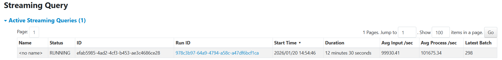
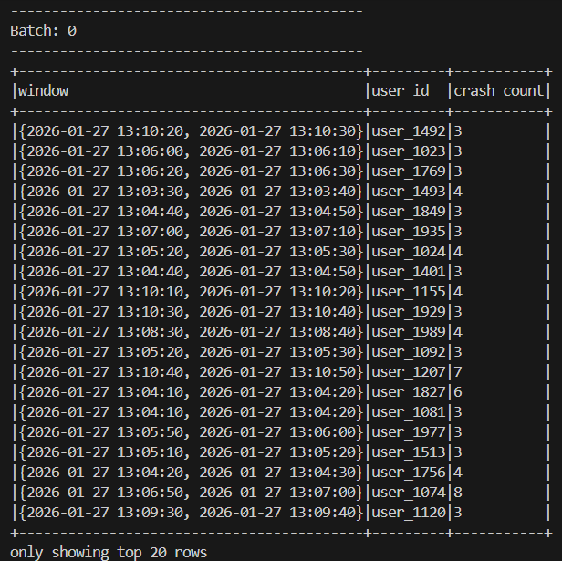
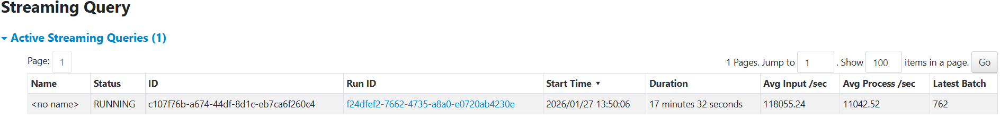
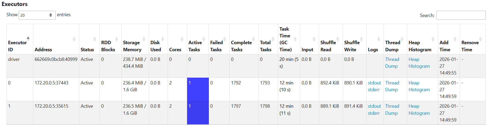

# Activity 1: Understanding the execution of Spark applications 

## 2. Key Concepts to Observe
As you navigate the UI, find and analyze the following sections to see Spark theory in action:

### A. The Jobs Tab & DAG Visualization
Every **Action** (like `.count()`, `.collect()`, or `.save()`) triggers a Spark Job. 
* **Task:** Click on a Job ID to see the **DAG Visualization**.
* **Concept:** Observe how Spark groups operations. Transformations like `map` or `filter` stay in one stage, while `sort` or `groupBy` create new stages.

### B. The Stages Tab
Stages represent a set of tasks that can be performed in parallel without moving data between nodes.
* **Concept:** Look for **Shuffle Read** and **Shuffle Write**. This represents data moving across the network—the most "expensive" part of distributed computing.

### C. The Executors Tab
This shows the "Workers" doing the actual computation.
* **Concept:** Check for **Data Skew**. If one executor has 10GB of Shuffle Read while others have 10MB, your data is not partitioned evenly.

---

## 3. Practical Exploration Questions
While your application is running, try to answer these questions:
1.  **The Bottleneck:** Which Stage has the longest "Duration"? What are the technical reasons for it?

On the Stages Tab I ordered by Duration. The Stage with id 1 has the longest Duration with 24 s. This stage contains way more steps than those with shorter duration. While these have only 2 steps, namely Shuffled Row (Exchange) and Map Partitions (WholeStageCodegen), the Stage 1 also reads the state store, and saves the state alongside Shuffled Row and Map Partitions. 

2.  **Resource Usage:** In the Executors tab, how much memory is currently being used versus the total capacity?

There are currently only 15.2 MB used out of 848.3 MB Storage Memory in total. 

3. Explain with your own words the main concepts related to performance and scalability in the scenario of Spark Structured Streaming.

Incoming data is grouped into small (micro-) batches. Performance depends on how quickly each micro-batch finishes, so the size of each batch plays a huge role. 

Batches are distributed across the worker nodes (= executors) that work in parallel. The batches are broken down into stages that can also be executed simultaneously. 

So the amount of batches, stages, and worker nodes is important for scalability. 

---

# Activity 2: Tuning for High Throughput

### The Challenge
Your goal is to scale your application to process **several hundred thousand events per second with batch sizes under 20 seconds to maintain reasonable event latency and data freshness**. On a standard laptop (8 cores / 16 threads), it is possible to process **1 million records per second** with micro-batch latencies staying below 12 seconds. 

Please note that the ```TARGET_RPS=10000``` configuration in the docker compose file of the load generator. This value represents how many records per second each instance of the load generator should produce. The load generator can also run in parallel with multiple docker instances to increase the generation speed.

### The Baseline Configuration
Review the starting configuration below. Identify which parameters are limiting the application's ability to use your hardware's full potential: 

From the previous example of how to run the Spark application:

### Tuning Configurations (The "Knobs")
You must decide how to adjust the configurations to increase the performance. Consider the relationship between your **CPU threads**, **RAM availability**, and **Parallelism**. Examples of configurations

| Parameter | Impact on Performance |
| :--- | :--- |
| `--num-executors` | Defines how many parallel instances (executors) run. |
| `--executor-cores` | Defines how many tasks can run in parallel on a single executor. |
| `--executor-memory` | Affects the ability to handle large micro-batches and shuffles in RAM. |
| `--conf "spark.sql.shuffle.partitions=2"` | Controls how many partitions are created during shuffles. |

---

See full configuration: https://spark.apache.org/docs/latest/submitting-applications.html and general configurations: https://spark.apache.org/docs/latest/configuration.html. Also check possible configurations with:

   ```bash
   spark-submit --help
   ```

### My Configuration

This is my configuration for Spark: 

```bash
spark-submit --master spark://spark-master:7077 --packages org.apache.spark:spark-sql-kafka-0-10_2.13:4.0.0 --num-executors 2 --executor-cores 2 --executor-memory 3G --conf "spark.sql.shuffle.partitions=2" /opt/spark-apps/spark_structured_streaming_logs_processing.py  
```

### Monitoring 
Navigate to the **Structured Streaming Tab** in the UI to monitor the performance:

####  * **Input Rate vs. Process Rate:** 
If your input rate is consistently higher than your process rate, your application is failing to keep up with the data stream.

The input rate is slightly lower than the processing rate: 


#### The Executors Tab
In the Executors Tab, check the **"Thread Dump"** and **"Task"** columns to verify resource utilization.

There is not all memory being used: 


Executor 1 is completing more tasks than executor 0 and also takes longer to do so. 

#### The SQL/Queries Tab
Click on the active query to see the **DAG (Directed Acyclic Graph)**.

* **Identify "Shuffle" Boundaries:** Look for the exchange points where data is redistributed across the cluster.

In the DAG I see two times "Exchange": 
1. The first time before HashAggregate
2. the second time before Sorting

* **Identify Data Skew:** Is data being distributed evenly across all your cores, or are a few tasks doing all the work? Use the DAG to pinpoint which specific transformation is causing a bottleneck.

The data is not evenly distributed across all available cores. The reason for that is mainly the first exchange point that is mentioned above.
Spark performs hashpartitioning with only 2 partitions. As a result, only two tasks can run in parallel after the exchange, leaving many executor cores idle and creating a performance bottleneck.

* **Submit activities 1 and 2 (answers and evidences) via Moodle until 20.01.2026**

# Activity 3 - Monitoring user experience in near real-time
## Technical Specification: Event Aggregation Logic

### Scenario: Continuous reporting of critical crash events

**Given** a stream of incoming event logs  
**When** a log entry has a `content` field containing the substring "crash"  
**And** the `severity` value is either "High" or "Critical"  
**And** logs are grouped by the `user_id` field, such as the crash count per `user_id`

**And** the system aggregates these occurrences in **10-second intervals** based strictly on the event `timestamp` field  
**Then** the system must output the aggregated results for each interval as they complete **When** the crash count of a given `user_id` is higher than 2 per interval.

#### Implementation Notes:
* Ensure the search for "crash" handles case sensitivity according to project standards.
* The 10-second interval logic must be tied to the record's metadata (`timestamp`), not the system arrival time.

#### Example of output
   ```bash
-------------------------------------------
Batch: 12
-------------------------------------------
+------------------------------------------+---------+-----------+
|Interval                                  |user_id  |crash_count|
+------------------------------------------+---------+-----------+
|{2026-01-11 14:42:50, 2026-01-11 14:43:00}|user_1836|5          |
|{2026-01-11 14:42:50, 2026-01-11 14:43:00}|user_1184|3          |
|{2026-01-11 14:42:50, 2026-01-11 14:43:00}|user_1946|3          |
|{2026-01-11 14:42:50, 2026-01-11 14:43:00}|user_1551|3          |
|{2026-01-11 14:42:50, 2026-01-11 14:43:00}|user_1841|3          |
|{2026-01-11 14:42:50, 2026-01-11 14:43:00}|user_1287|3          |
|{2026-01-11 14:42:50, 2026-01-11 14:43:00}|user_1028|3          |
|{2026-01-11 14:42:50, 2026-01-11 14:43:00}|user_1288|3          |
+------------------------------------------+---------+-----------+
```

## 2. Non-Functional Requirements
* **Scalability:** The architecture must support horizontal scaling, allowing the logic to be distributed across a cluster of multiple machines.
* **Fault Tolerance:** The system must support recovery in the event of infrastructure failure of the worker nodes.

My code to achieve the following output, can be found in ```logs_processing/part3_spark_structured_streaming_logs_processing.py```
This is the output of the first batch: 


To achieve the grouping in 10 second intervals, it was vital to transform the timestamp column into the format that is needed to be able to use the ```window``` function of spark later on: 
```python
.withColumn("event_time", to_timestamp(col("timestamp") / 1000))
```

As in Activity 2, I decided to use 2 executors with 2 cores and 3 GB of memory each. Since I had troubles to get outputs at first, I decided to minimize the amount of responses, so I set ```TARGET_RPS=10000``` in the ```docker-compose.yaml``` of the load generator. 

The architecture supports horizontal scaling, I am already in my solution spreading it across 2 executor nodes. By saving checkpoints during the spark session, the system is able to support recovery in the event of infrastructure failure of worker nodes. 

When having a look at the Average Processing Speed and comparing that to the Average Input Speed, it is evident that my solution and configuration with 2 executors is not fast enough.


Comparing the amount of Tasks each Executor has finished and how long it took them to finish, it seems like the workload is split very equal between the two of them. Both do not need all the memory that I provided them with. 



For my solution to also handle late-arriving records, I would need to add a Watermark to my Spark configuration file. 

## Deliverables for Activity 3
You are required to submit your application source code accompanied by a technical discussion. This discussion must explain how your specific implementation satisfies the requirements, including a discussion on your solution could handle the scenario of late-arriving records that can appear after a 10-second interval has concluded. Furthermore, you must provide a performance and scalability report that evaluates the performance and efficiency of your solution and discuss its ability to execute effectively across a multi-machine environment. Submit via Moodle until 27.01.2026
